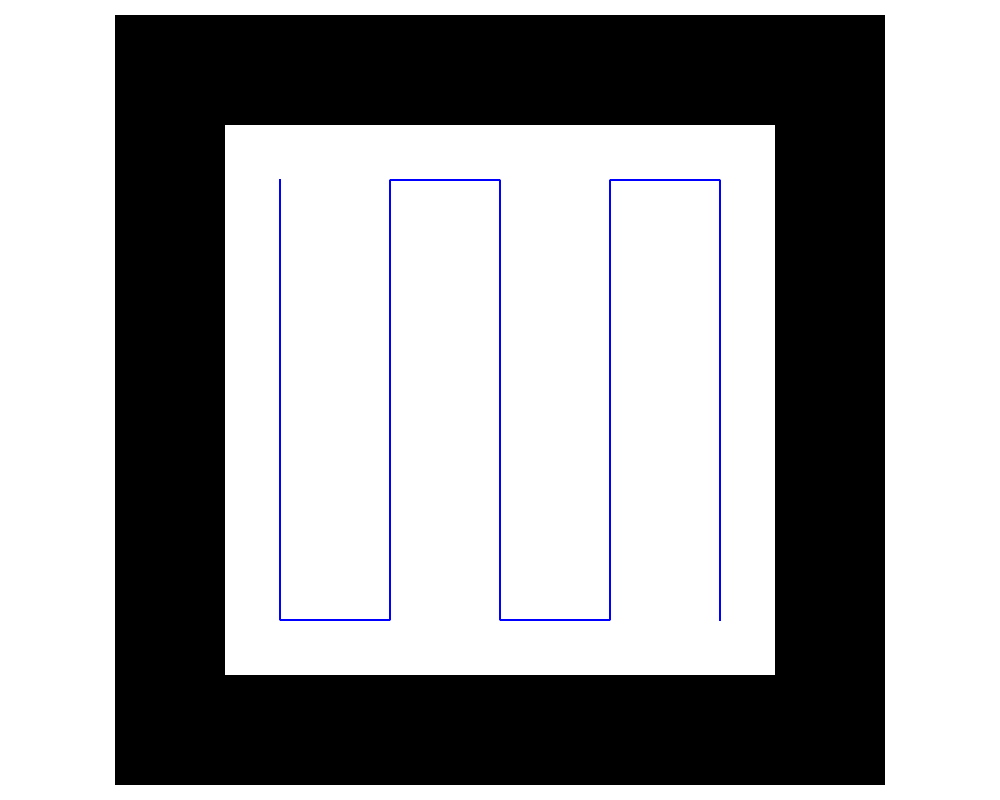
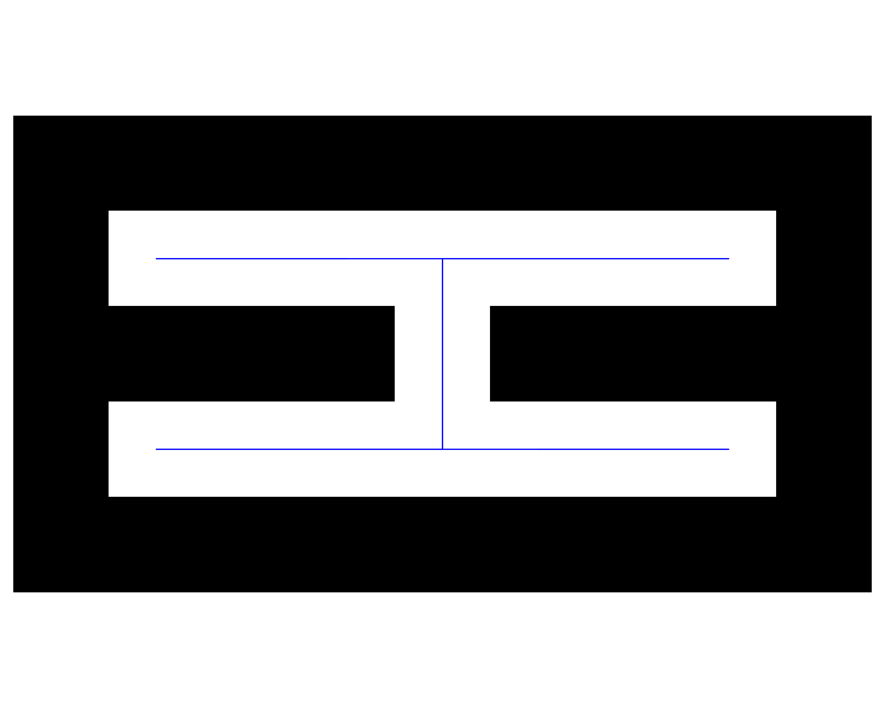
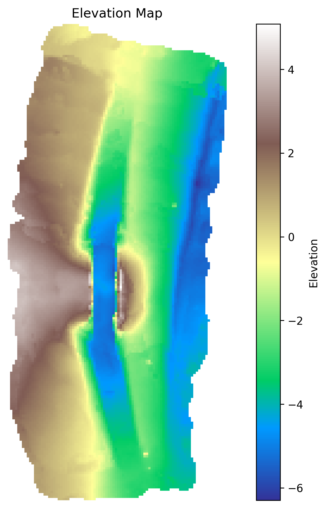
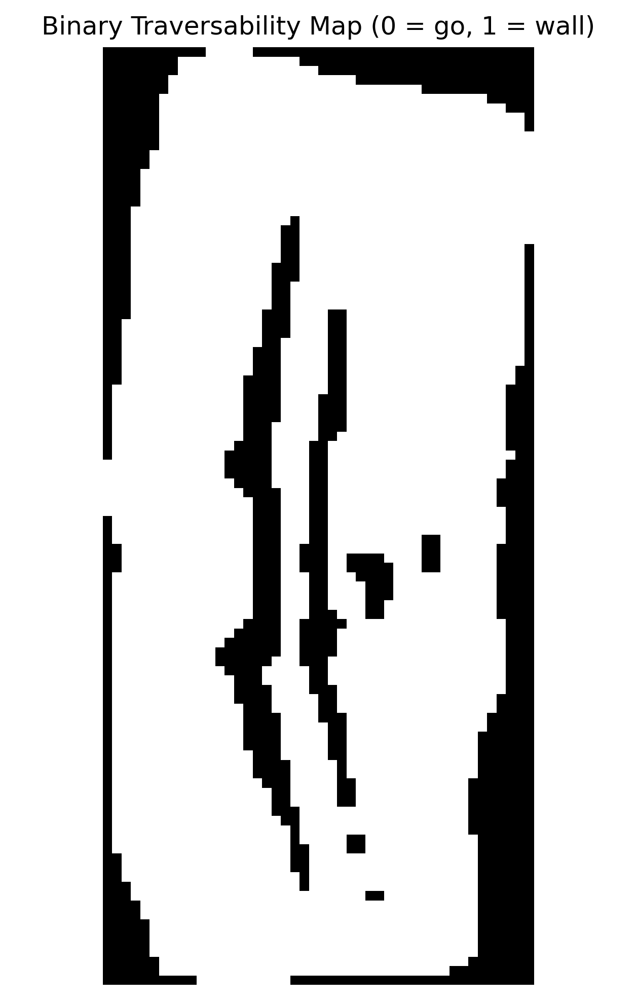
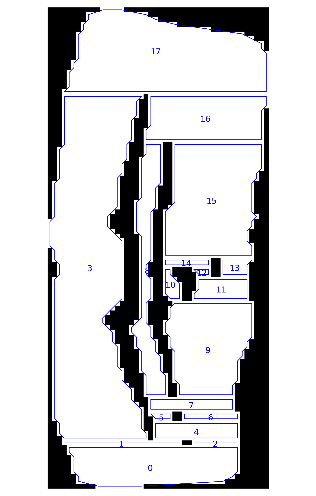
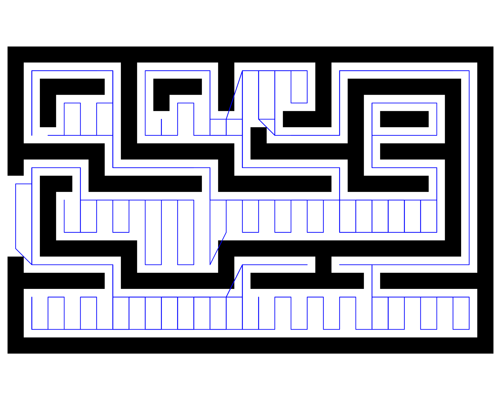
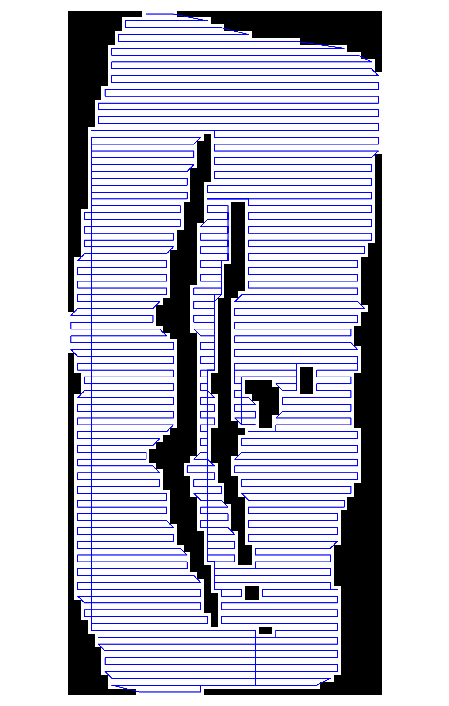
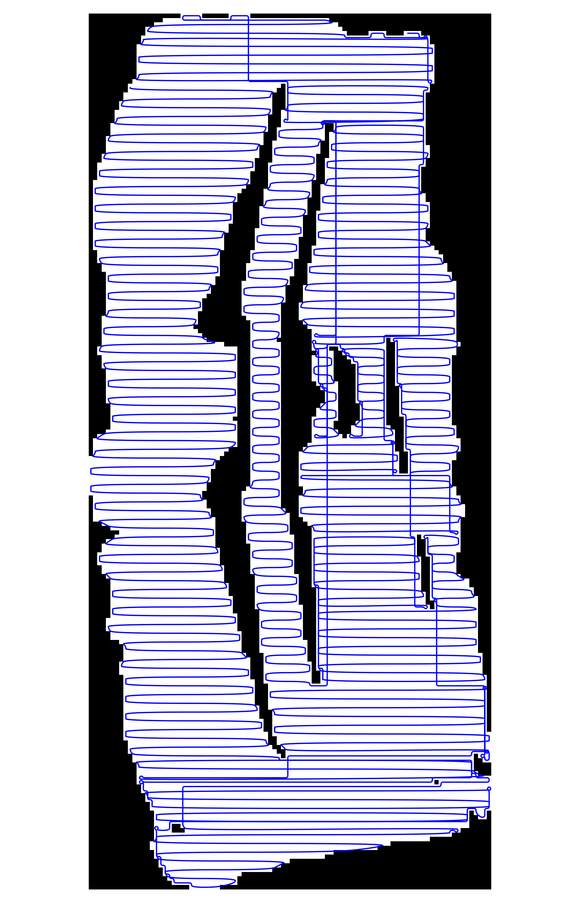
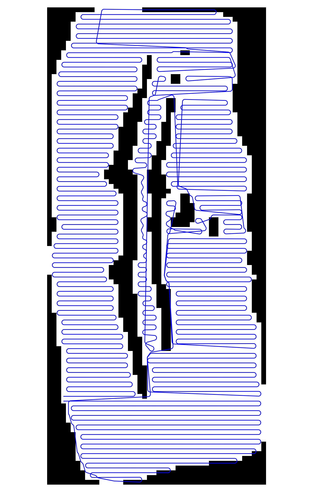
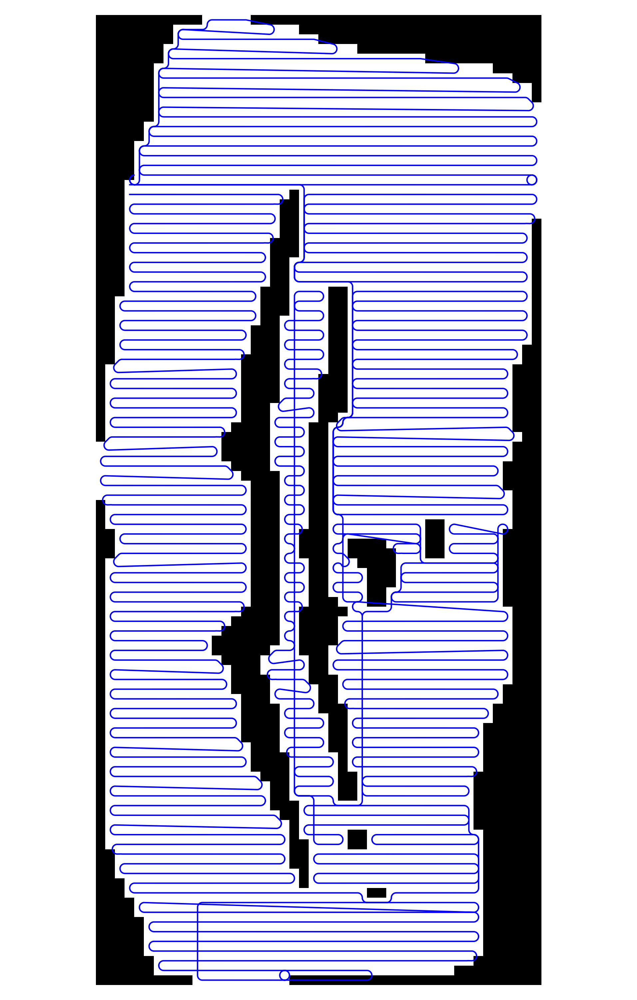

# NASA DCGR Project - Astrobotic Rover Control & Mapping

## Overview
This repository contains software for the Astrobotic rover, developed as part of the NASA Deep Contact Graph Routing (DCGR) for Lunar Operations project, providing manual rover control via a Bluetooth controller and autonomous navigation along a coverage path. It includes all components needed for autonomous operation, such as elevation map creation from LiDAR data, traversability binary map generation, and coverage path planning.

## Features
- **Manual Control** - Skid-steer driving with PS4 controller input.
- **Autonomous Control** - Drives the rover along generated coverage paths through map-based navigation.
- **Mapping** - Generates elevation maps and binary traversability maps from LiDAR scans.
- **Coverage Path Planning** - Uses boustrophedon cellular decomposition (BCD) to create lawnmower style paths for full coverage of an area.
- **Path Tracking** - Pure pursuit algorithm that follows waypoints using position data from camera, GPS, or IMU.

## Code Modules
### Mapping & Conversion
- **blank_binary_map.py** - Creates an empty binary map of given dimensions.
- **ply_to_elevation_map.py** - Generates an elevation map from a PLY mesh.
- **elevation_map_to_ply.py** - Converts an elevation map back into a PLY mesh.
- **elevation_to_binary_map.py** - Converts an elevation map into a binary map based on the rover's ability to traverse terrain.

### Path Planning
- **cellular_decomposition.py** - Decomposes binary map into cells using BCD and determines efficient traversal order.
- **coverage_path.py** - Generates full coverage path from cellular decomposition.
- **scale_coverage_path.py** - Scales coverage path from map units to real-world units.
- **smooth_add_points.py** - Adds intermediate points for pure pursuit without changing path headings.
- **smooth_chaikin_curve.py** - Smooths path using Chaikin curve algorithm for easier following.
- **smooth_dubins_path.py** - Smooths path with Dubins curves, accounting for rover turning radius limits.
- **smooth_turning_radius.py** - Smooths path using a general turning radius constraint (non-Dubins method, less reliable).

### Rover Control
- **controller_skid_steer.py** - Manual skid-steer drive control using a PS4 controller on the Astrobotic rover.

### Path Tracking
- **path_tracking_position.py** - Position-based path tracking that works with any source providing `(x,y,heading)` in a consistent frame (e.g., camera, GPS, other adaptable sensors).
- **path_tracking_imu.py** - IMU-based path tracking using onboard sensors on the Astrobotic rover (less accurate).
- **gps_data_to_rover.py** - Sends GPS position data over netcat to the rover from the Jetson.
- **gps_data_to_rover.launch** - Launches `gps_data_to_rover.py`.

#### Heading Conventions
By default, heading inputs are converted from compass convention (0° = North, CW+) to math convention (0 = +X, CCW+). Edit this conversion if your input uses a different heading format.
```
cameraHeading = compassDegToMathRad(float(headingStr))
```

#### Parameters
The following constants can be tuned in path tracking code:
- **LOOKAHEAD_DISTANCE** - Pure pursuit lookahead distance in meters. Larger values smooth turns but reduce accuracy.
- **TURN_GAIN** - Factor that controls turning aggressiveness. Use higher values if the rover understeers due to skid.
- **ADAPTIVE_SPEED_SCALE** - Scalining factor for how much speed is maintained in turns. Higher values allow higher speeds for tight turns.
- **ADAPTIVE_SPEED_MIN** - Minimum speed factor when navigating the tightest turns.
- **ROVER_TRACK_WIDTH** - Track width of the rover in meters. For the Astrobotic rover with default wheels, this is 0.34 m.

## Usage
### Manual Control
```
python controller_skid_steer.py [--no_joystick] [--max_speed <int>]
```

### Generate a Coverage Path
```
# Start from a PLY mesh:
python ply_to_elevation_map.py <input_ply> <output_csv> [--resolution <int>] [--elevation_axis {x|y|z}] [--smooth_passes <int>]
python elevation_to_binary_map.py <input_csv> <output_csv> [--threshold <float>] [--smooth_passes <int>]
python cellular_decomposition.py <input_csv> <decomposition_csv>
python coverage_path.py <decomposition_csv> <coverage_path_csv> [--coverage_diameter <float>] [--start <x,y>]

# Smooth the path (required) by selecting one of the methods below:
# To avoid real smoothing, use smooth_add_points.py to densify path instead.
python smooth_chaikin_curve.py <input_path> <output_path>
python smooth_dubins_path.py <input_path> <output_path> [--turning_radius <float>] [--step_size <float>] [--threshold <float>]
python smooth_turning_radius.py <input_path> <output_path> [--turning_radius <float>] [--step_degree <float>]
python smooth_add_points.py <input_path> <output_path> [--spacing <float>]

# Scale the coverage path:
python scale_coverage_path.py <input_path> <output_path> [--scale <float>|<float>/<float>]
```

### Autonomous Path Tracking
```
python path_tracking_position.py <coverage_path> [--max_speed <int>] [--time_step <float>] [--start <x,y>] [--start_heading <float>] [--port <int>]
# or
python path_tracking_imu.py <coverage_path> [--max_speed <int>] [--time_step <float>] [--start <x,y>] [--start_heading <float>]

# GPS bridge if needed:
roslaunch gps_data_to_rover.launch [ip:=<string>] [port:=<int>]
```

### Example Coverage Paths
Four example coverage paths are provided in the `examples/` folder for testing the path tracking modules:
- `coverage_path_small_square.csv` - 2.5m × 2.5m square
- `coverage_path_large_square.csv` - 5m × 5m square
- `coverage_path_small_h.csv` - 3.5m × 1.5m sideways H
- `coverage_path_large_h.csv` - 7m × 3m sideways H

Each path starts at the top-left corner.
<table>
  <tr>
    <th align="center">Square Coverage Path</th>
    <th align="center">Sideways H Coverage Path</th>
  </tr>
  <tr>
    <td width="50%" align="center">
      
    </td>
    <td width="50%" align="center">
      
    </td>
  </tr>
</table>

## Gallery
### Pipeline
<table>
  <tr>
    <th align="center">Elevation Map</th>
    <th align="center">Binary Map</th>
  </tr>
  <tr>
    <td width="50%" align="center">
      
    </td>
    <td width="50%" align="center">
      
    </td>
  </tr>
  <tr>
    <th align="center">Cellular Decomposition</th>
    <th align="center">Coverage Path</th>
  </tr>
  <tr>
    <td width="50%" align="center">
      
    </td>
    <td width="50%" align="center">
      
    </td>
  </tr>
</table>

### Smoothing
<table>
  <tr>
    <th align="center">Unsmoothed Path / Add Points</th>
    <th align="center">Chaikin Curve</th>
  </tr>
  <tr>
    <td width="50%" align="center">
      
    </td>
    <td width="50%" align="center">
      
    </td>
  </tr>
  <tr>
    <th align="center">Dubins Path</th>
    <th align="center">Turning Radius</th>
  </tr>
  <tr>
    <td width="50%" align="center">
      
    </td>
    <td width="50%" align="center">
      
    </td>
  </tr>
</table>
