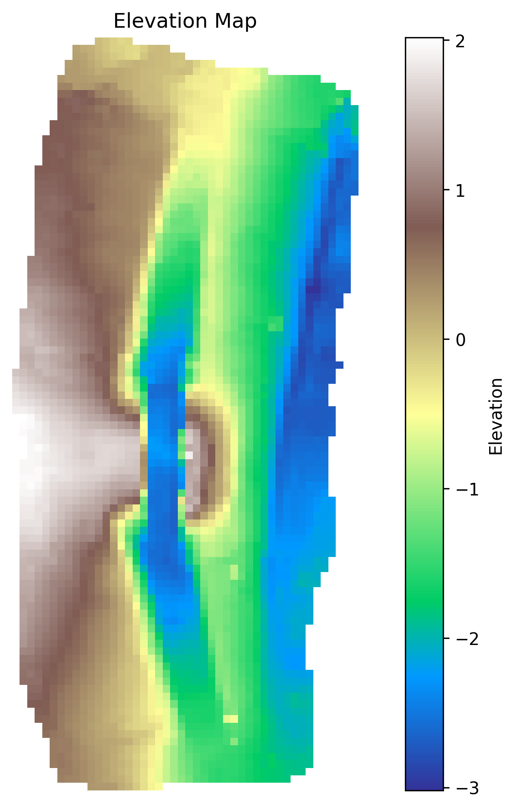
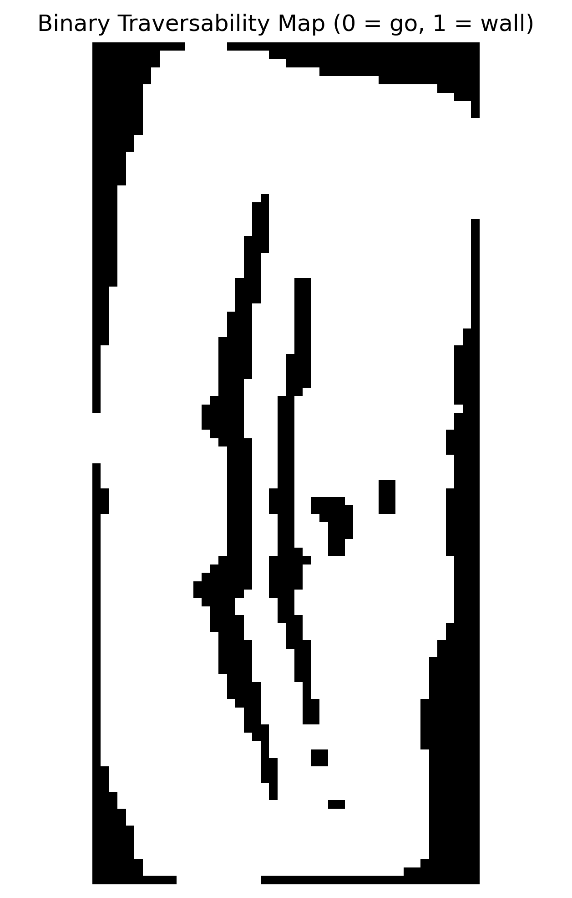

# NASA DGCR Project - Astrobotic Rover Control & Mapping

## Overview
This repository contains software for the Astrobotic rover, developed as part of the NASA Dynamic Ground Coverage Robotics (DGCR) project, providing manual rover control via Bluetooth controller and autonomous navigation along a coverage path. It includes all components needed for autonomous operation, such as elevation map creation from LiDAR data, traversability binary map generation, and coverage path planning.

## Features
- **Manual Control** - Skid-steer driving with PS4 controller input.
- **Autonomous Control** - Drives the rover along generated coverage paths through map-based navigation.
- **Mapping** - Generates elevation maps and binary traversability maps from LiDAR scans.
- **Coverage Path Plannign** - Uses boustrophedon cellular decomposition (BCD) to create lawnmower style paths for full coverage of an area.
- **Path Tracking** - Pure pursuit algorithm that follows waypoints using position data from camera, GPS, or IMU.

## Code Modules
### Mapping & Conversion
- **BlankBinaryMap.py** - Creates an empty binary map of given dimensions.
- **PlyToElevationMap.py** - Generates an elevation map from a PLY mesh.
- **ElevationMapToPly.py** - Converts an elevation map back into a PLY mesh.
- **ElevationToBinaryMap.py** - Converts an elevation map into a binary map based on the rover's ability to traverse terrain.

### Path Planning
- **CellularDecomposition.py** - Decomposes binary map into cells using BCD and determines efficient traversal order.
- **CoveragePath.py** - Generates full coverage path from cellular decomposition.
- **ScaleCoveragePath.py** - Scales coverage path from map units to real-world units.
- **SmoothAddPoints.py** - Adds intermediate points for pure pursuit without changing path headings.
- **SmoothChaikinCurve.py** - Smooths path using Chaikin curve algorithm for easier following.
- **SmoothDubinsPath.py** - Smooths path with Dubins curves, accounting for rover turning radius limits.
- **SmoothTurningRadius.py** - Smooths path using general turning radius constraint (non-Dubins method).

### Rover Control
- **ControllerSkidSteer.py** - Manual skid-steer drive control using PS4 controller on the Astrobotic rover.

### Path Tracking
- **PathTrackingPosition.py** - Position-based path tracking that works with nay source pproviding `(x,y,heading)` in a consistent frame (e.g., camera, GPS, other adaptable sensors).
- **PathTrackingIMU.py** - IMU-based path tracking using onboard sensors on the Astrobotic rover (less accurate).
- **GPSDataToRover.py** - Sends GPS position data over netcat to the rover from Jetson.
- **gps_data_to_rover.launch** - Launches `GPSDataToRover.py`.

## Usage
### Manual Control
```
python ControllerSkidSteer.py [--noJoystick] [--maxSpeed <int>]
```

### Generate a Coverage Path
```
# Start from a PLY mesh:
python PlyToElevationMap.py <inputPly> <outputCsv> [--resolution <int>] [--elevationAxis {x|y|z}] [--smoothPasses <int>]
python ElevationToBinaryMap.py <inputCsv> <outputCsv> [--threshold <float>] [--smoothPasses <int>]
python CellularDecomposition.py <inputCsv> <decompositionCsv>
python CoveragePath.py <decompositionCsv> <coveragePathCsv> [--coverageDiameter <float>] [--start <x,y>]

# Smooth the path (required), select one of the methods below:
# To avoid real smoothing, use SmoothAddPoints.py to densify path instead.
python SmoothChaikinCurve.py <inputPath> <outputPath>
python SmoothDubinsPath.py <inputPath> <outputPath> [--turningRadius <float>] [--stepSize <float>] [--threshold <float>]
python SmoothTurningRadius.py <inputPath> <outputPath> [--turningRadius <float>] [--stepDegree <float>]
python SmoothAddPoints.py <inputPath> <outputPath> [--spacing <float>]

# Scale at the end:
python ScaleCoveragePath.py <inputPath> <outputPath> [--scale <float>|<num>/<num>]
```

### Autonomous Path Tracking
```
python PathTrackingPosition.py <inputPath> [--maxSpeed <int>] [--timeStep <float>] [--start <x,y>] [--startHeading <float>] [--port <int>]
# or
python PathTrackingIMU.py <inputPath> [--maxSpeed <int>] [--timeStep <float>] [--start <x,y>] [--startHeading <float>]

# GPS bridge if needed:
roslaunch gps_data_to_rover.launch [ip:=<string>] [port:=<int>]
```

## Gallery
### Pipeline
| Elevation Map | Binary Map | Cellular Decomposition | Coverage Path |
| --- | --- | --- | --- |
|  |  |  |  |

### Smoothing
| Unsmoothed Path / Add Points | Chaikin Curve | Dubins Path | Turning Radius |
| --- | --- | --- | --- |
|  |  |  |  |

## Gallery

### Pipeline
<table>
  <tr>
    <td width="50%" align="center">
      <b>Elevation Map</b><br/>
      
    </td>
    <td width="50%" align="center">
      <b>Binary Map</b><br/>
      
    </td>
  </tr>
  <tr>
    <td width="50%" align="center">
      <b>Cellular Decomposition</b><br/>
      
    </td>
    <td width="50%" align="center">
      <b>Coverage Path</b><br/>
      
    </td>
  </tr>
</table>

### Smoothing
<table>
  <tr>
    <td width="50%" align="center">
      <b>Unsmoothed Path / Add Points</b><br/>
      
    </td>
    <td width="50%" align="center">
      <b>Chaikin Curve</b><br/>
      
    </td>
  </tr>
  <tr>
    <td width="50%" align="center">
      <b>Dubins Path</b><br/>
      
    </td>
    <td width="50%" align="center">
      <b>Turning Radius</b><br/>
      
    </td>
  </tr>
</table>
